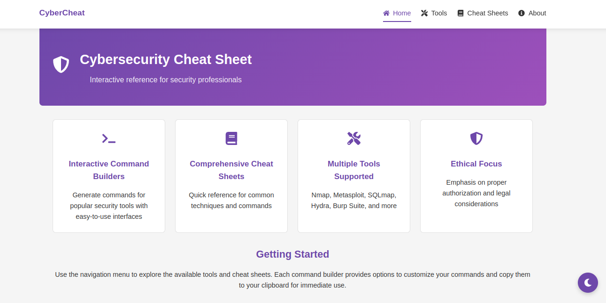
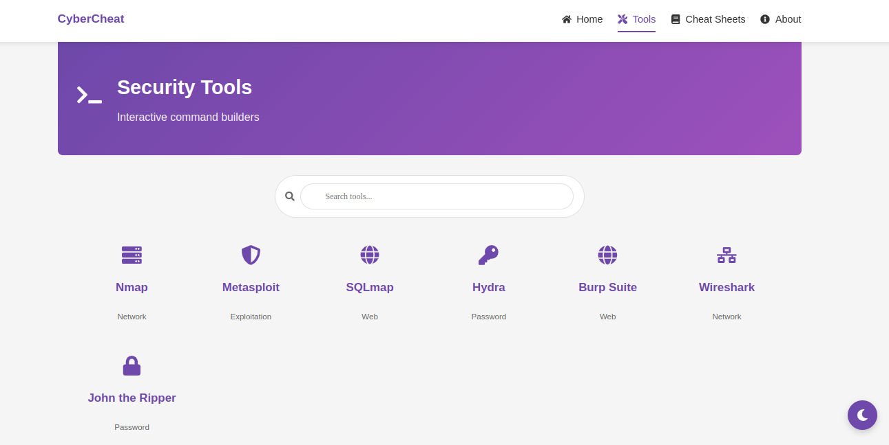

# 🔐 CyberCheat: Interactive Cybersecurity Toolkit

 <!-- Replace with actual image URL -->

**Quick-access command builders & cheat sheets for ethical hackers, pentesters, and security professionals.**

---

## 🚀 Features

- 🎛 **Interactive Command Builders**  
  Generate customized commands for tools like `Nmap`, `Metasploit`, `SQLmap`, `Hydra`, and more.

- 📚 **Comprehensive Cheat Sheets**  
  Instant references for:
  - Linux & Windows Privilege Escalation
  - Web Application Testing
  - Cloud Pentesting (AWS, Azure)
  - Active Directory Enumeration & Attacks
  - Payload Generation, C2 Frameworks & Post-Exploitation

- 📋 **One-Click Copy**  
  Copy any command or code block directly to your clipboard with a single click.

- 💡 **Responsive UI**  
  Mobile-friendly and optimized for all devices.

- 🌓 **Dark/Light Mode**  
  Switch between themes based on your preference.

---

## 🛠️ Tech Stack

- **Frontend**: React.js (Hooks), Framer Motion (Animations)
- **Styling**: CSS Custom Properties (for Theming)
- **Icons**: React Icons
- **Markdown Rendering**: `react-markdown`
- **Clipboard**: `react-copy-to-clipboard`
- **Notifications**: `react-toastify`
- **Hosting**: [Vercel](https://vercel.com) / Netlify / GitHub Pages (choose your host)

---

## 📦 Installation & Usage

### 🔧 Local Development

```bash
git clone https://github.com/Vasoyasharan/cyber-cheatsheet.git
cd cyber cheatsheet
npm install
npm start
```

---

## 🌐 Web Access

Access the live demo: [https://cyber-cheatsheet.onrender.com](https://cyber-cheatsheet.onrender.com)

---

## 🖼️ Screenshots

Cheat Sheets


Command Builders


---

## ⚠️ Legal Disclaimer

This tool is intended **strictly for educational and authorized penetration testing** purposes.  
**Always get proper authorization before conducting any tests.**  
Misuse of this toolkit can lead to criminal charges. Use responsibly.

---

## 🤝 Contributing

Contributions are welcome!

- 🐛 Found a bug? [Open an issue](https://github.com/Vasoyasharan/cyber-cheatsheet/issues)
- 🌟 Got a feature idea? Submit a pull request or start a discussion.

---

Built with ❤️ by [Sharan Vasoya](https://github.com/Vasoyasharan)
