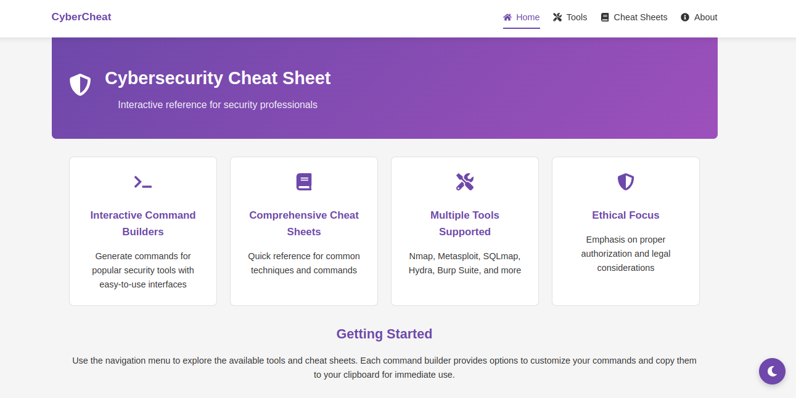
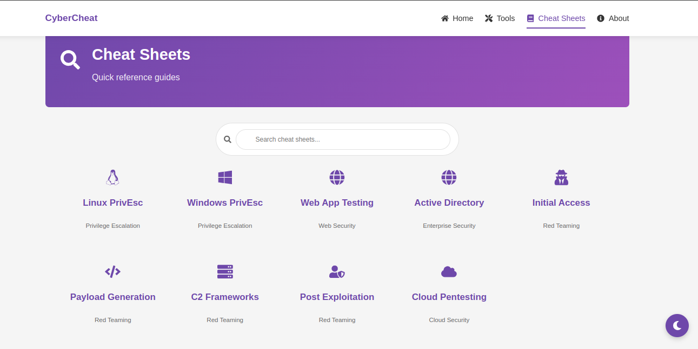
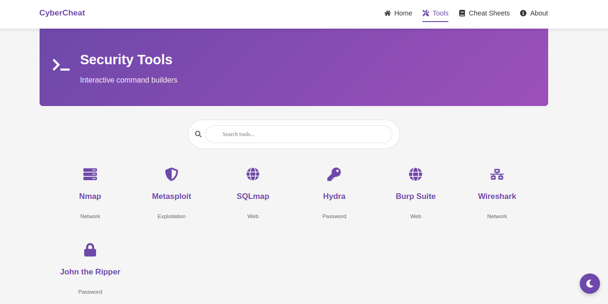

# 🔐 CyberCheat: Interactive Cybersecurity Toolkit

 <!-- Replace with actual image URL -->

**The ultimate quick-access command builders, cheat sheets, and security references for ethical hackers, pentesters, security researchers, and cybersecurity professionals.**

---

## 🚀 Core Features

### 🎛 **23 Interactive Command Builders**
Generate customized, production-ready commands for:
- **Scanning & Enumeration**: Nmap, Gobuster, Ffuf, Nikto, Enum4linux, Aircrack-ng, TheHarvester, DNSrecon, Dimitry, Wireshark
- **Exploitation**: Metasploit, SQLmap, Hydra, NetCat, CrackMapExec, BurpSuite, Wfuzz
- **Cryptography & Forensics**: John the Ripper, Hashcat, Hash Identifier
- **Automation & OSINT**: PowerShell, OSINT Quick Reference
- **Incident Response**: IR Checklist with structured methodology

### 📚 **16 Comprehensive Cheat Sheets**
Instant references for critical security domains:
- **Privilege Escalation**: Linux PrivEsc, Windows PrivEsc
- **Web Security**: Web Application Testing, API Security
- **Network & Infrastructure**: Cloud Pentesting (AWS, Azure, GCP), Active Directory Enumeration & Attacks
- **Offensive Techniques**: Initial Access Techniques, Post-Exploitation, Payload Generation, C2 Frameworks, Reverse Engineering
- **Additional Resources**: Cryptography, Mobile Security, OSINT Techniques, Incident Response

### 🔍 **Advanced Search & Discovery**
- Real-time search across all tools and cheat sheets
- Filter by difficulty level (Beginner, Intermediate, Advanced)
- Category-based filtering for quick navigation
- Smart search indexing for instant results

### 📖 **10+ Specialized Pages**
- **Command Explainer**: Break down and understand complex security commands step-by-step
- **Payload Library**: Curated collection of payloads for various attack scenarios
- **Port Reference**: Quick lookup for common ports and their services
- **CVE Lookup**: Search and understand common vulnerabilities
- **Glossary**: Comprehensive cybersecurity terminology reference
- **Learning Paths**: Structured learning roadmaps for different specializations
- **Utilities**: Additional security tools and calculators
- **About**: Project information and disclaimer

### 💾 **Smart Data Persistence**
- **Command History**: Last 20 commands with persistent storage via localStorage
- **Recently Viewed Tracking**: Quick access to frequently used tools
- **Theme Preferences**: Dark/Light mode settings saved automatically
- **Sidebar State**: Navigation state persists across sessions

### 📋 **User Experience**
- ✨ **One-Click Copy**: Copy any command or code snippet directly to clipboard with visual feedback
- 🎨 **Dark/Light Mode**: Toggle between themes for comfortable viewing in any environment
- 📱 **Fully Responsive Design**: Optimized for desktop, tablet, and mobile devices
- 🎭 **Smooth Animations**: Framer Motion-powered transitions and interactions
- ♿ **Accessibility**: ARIA labels and semantic HTML for screen readers

---

## 🛠️ Tech Stack

- **Frontend Framework**: React 19.1.0 (with Hooks & Context API)
- **Routing**: React Router DOM v7.5.3
- **Animations**: Framer Motion v12.9.2
- **Styling**: CSS Custom Properties with SCSS support (node-sass)
- **Icons**: React Icons v5.5.0
- **Markdown**: react-markdown v10.1.0
- **Notifications**: react-toastify v11.0.5
- **Testing**: React Testing Library
- **Build Tool**: Create React App with custom scripts

---

## 📦 Installation & Usage

### 🔧 Local Development

```bash
# Clone the repository
git clone https://github.com/Vasoyasharan/cyber-cheatsheet.git
cd cyber-cheatsheet

# Install dependencies
npm install

# Start development server (runs on http://localhost:3000)
npm start

# Build for production
npm build

# Run tests
npm test
```

### 🌐 Live Demo

Access the application: [https://cyber-cheatsheet.onrender.com](https://cyber-cheatsheet.onrender.com)

---

## � Project Structure

```
cyber-cheatsheet/
├── public/                  # Static assets and HTML template
├── src/
│   ├── components/
│   │   ├── CheatSheets/     # 16 cheat sheet modules
│   │   ├── CommandBuilders/ # 23 interactive tool builders
│   │   ├── Layout.js        # Main layout wrapper
│   │   ├── Search.js        # Global search component
│   │   └── UI/              # Reusable UI components
│   ├── pages/               # Route pages (Tools, CheatSheets, CVELookup, etc.)
│   ├── contexts/            # React Context providers
│   │   ├── CommandHistoryContext.js
│   │   ├── ThemeContext.js
│   │   ├── RecentlyViewedContext.js
│   │   └── SidebarContext.js
│   ├── styles/              # Global styling and themes
│   ├── utils/               # Helper functions
│   └── data/                # Static data and search indices
└── build/                   # Production build output
```

---

## 🎯 Available Command Builders

| Category | Tools |
|----------|-------|
| **Scanning** | Nmap, Gobuster, Ffuf, Nikto, Aircrack-ng, TheHarvester, DNSrecon, Dimitry, Enum4linux |
| **Exploitation** | Metasploit, SQLmap, Hydra, NetCat, CrackMapExec, Wfuzz, BurpSuite |
| **Forensics** | John the Ripper, Hashcat, Hash Identifier, Wireshark |
| **Automation** | PowerShell, OSINT Quick Reference, IR Checklist |

---

## 📚 Cheat Sheet Categories

- **Privilege Escalation**: Linux & Windows techniques
- **Web Security**: OWASP, API testing, injection attacks
- **Cloud Security**: AWS, Azure, GCP pentesting
- **Active Directory**: Enumeration, attacks, lateral movement
- **Offensive Security**: Payloads, C2 frameworks, post-exploitation
- **Advanced Topics**: Cryptography, mobile security, reverse engineering, OSINT

---

## 🖼️ Screenshots

### Dashboard & Search


### Command Builder Interface


---

## 🔐 Security & Best Practices

### Command Builders
- All commands are template-based and must be customized for your specific target
- Built-in parameter validation and error handling
- Instant command preview before execution
- Copy-to-clipboard with one click

### Cheat Sheets
- Educational references with proper context
- Links to official documentation and resources
- Includes OPSEC considerations where applicable
- Regularly updated with latest techniques

---

## 🌟 Key Features In Detail

### Search & Navigation
- **Global Search**: Find any tool or cheat sheet instantly
- **Keyboard Navigation**: Use Escape key to close dialogs, quick access shortcuts
- **Filter System**: Filter by difficulty level and category
- **Recent History**: Quick access to recently viewed tools

### Developer Experience
- **Context API**: Efficient state management
- **Custom Hooks**: Reusable logic for animations and localStorage
- **Component Composition**: Modular, maintainable architecture
- **Responsive Grid**: Mobile-first design approach

### Performance
- **Lazy Loading**: Pages load on-demand
- **Optimized Assets**: Minified and optimized production build
- **LocalStorage Caching**: Instant theme and history loading
- **Smooth Animations**: Hardware-accelerated Framer Motion

---

## 🔐 Legal Disclaimer

⚠️ **IMPORTANT NOTICE**

This tool is intended **strictly for educational and authorized penetration testing** purposes only.

**Before using this toolkit, ensure you:**
- Have explicit written authorization from the system owner
- Are conducting tests in a controlled, authorized environment
- Understand and follow all applicable laws and regulations
- Use this knowledge responsibly and ethically

**Unauthorized access to computer systems is illegal and can result in:**
- Criminal prosecution and imprisonment
- Civil liability and monetary damages
- Loss of professional credentials and career opportunities

**The creator assumes no liability for misuse of this toolkit.**  
Use responsibly. Always get proper authorization before conducting any tests.

---

## 🤝 Contributing

Contributions are welcome! Help improve the toolkit:

### Ways to Contribute
- 🐛 **Bug Reports**: Found an issue? [Open an issue](https://github.com/Vasoyasharan/cyber-cheatsheet/issues)
- 💡 **Feature Ideas**: Suggest new tools or cheat sheets
- 📝 **Content**: Improve or add new cheat sheets
- 🎨 **UI/UX**: Enhance design and usability
- 🧪 **Testing**: Help test on different devices and browsers

### How to Contribute
1. Fork the repository
2. Create a feature branch (`git checkout -b feature/AmazingFeature`)
3. Commit your changes (`git commit -m 'Add AmazingFeature'`)
4. Push to the branch (`git push origin feature/AmazingFeature`)
5. Open a Pull Request

---

## 📊 Project Stats

- **23** Command Builders
- **16** Cheat Sheets
- **11** Specialized Pages
- **10+** UI Components
- **4** Context Providers
- **20+** Utility Functions
- **React 19** with Hooks & Context API
- **Fully Responsive** Design

---

## 🚀 Future Roadmap

- [ ] Database integration for custom command templates
- [ ] User accounts and saved commands
- [ ] Command execution simulator
- [ ] Community contribution platform
- [ ] Mobile app (React Native)
- [ ] Advanced analytics for tool usage
- [ ] Multi-language support
- [ ] Video tutorials for complex commands

---

## 📝 License

This project is open source and available under the MIT License. See LICENSE file for details.

---

## 🙏 Acknowledgments

- Built with [React](https://react.dev)
- Animations powered by [Framer Motion](https://www.framer.com/motion/)
- Icons from [React Icons](https://react-icons.github.io/react-icons/)
- Inspired by the cybersecurity community

---

## 📞 Contact & Support

- **Author**: [Sharan Vasoya](https://github.com/Vasoyasharan)
- **GitHub**: [Vasoyasharan/cyber-cheatsheet](https://github.com/Vasoyasharan/cyber-cheatsheet)
- **Issues**: [Report bugs or request features](https://github.com/Vasoyasharan/cyber-cheatsheet/issues)
- **Live Demo**: [https://cyber-cheatsheet.onrender.com](https://cyber-cheatsheet.onrender.com)

---

## ⭐ Show Your Support

If you find this toolkit useful, please consider:
- Giving it a star ⭐ on GitHub
- Sharing it with the security community
- Contributing improvements or bug fixes
- Providing feedback and suggestions

---

Built with ❤️ and passion for cybersecurity by [Sharan Vasoya](https://github.com/Vasoyasharan)

*Last Updated: 2026 | Continuously Improved*
